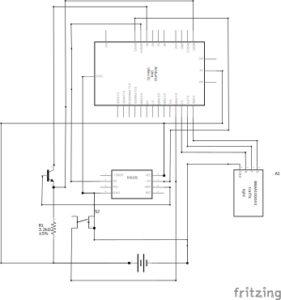

# HAL-WDT

A hardware abstraction layer (HAL) for watchdog timers (WDT) for AVR micro controllers.

## Tools

Developed with PlatformIO.

## General

This project is intended to be used as a library. Therefore any code to be used as dependendencies is located under `include/` and the `src/` folder contains internal implementation and tests.
The code comments are currently German but you should not have difficulties translating them with the help of any online translator.

## WDT HAL

A common interface for different HAL devices lies under [/include/hal-wdt.h](/include/hal-wdt.h)

Currently two implementations of the interface are done that can be included as dependencies:

1. [Internal WDT of ATmega-328p (Arduino Uno)](include/hal-wdt-internal-atmega-328p.h)
2. [DS1232](include/hal-wdt-ds1232.h)

## GPIO HAL
To be able to define the GPIO ports for an external WDT like DS1232, a stripped-down [HAL for GPIO](include/hal-gpio-atmega-328p.h) is defined to be independent from any code that comes with AVR-GCC.

## TEST HAL
You can find collection for automated integration tests under `src/test`. A HAL to abstract testing functionalities like the publication of the test result is written. Currently only one implementation on the basis of LEDs (e.g. blinking a red LED to signal a test error) is done. The purpose of abstracting those functions in a HAL is to possibly implement better ways for such automatest tests like using serial communication. 

You can find some example calls to the tests under [src/main.c](src/main.c)

Here is the testing setup used to test the DS1232:

